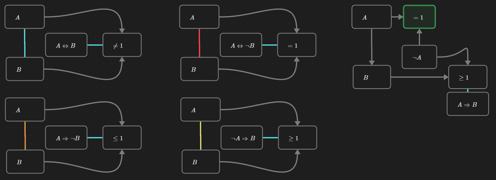

# Visualizing Propositional Logic in Obsidian

This repository provides examples of how to use [Obsidian](https://obsidian.md/) to develop and visualize proofs of mathematical theorems. In addition, we show that implications and negation can be formulated in terms of the number of true propositions within a set of propositions. We believe that these methods can be used to improve mathematics communication in classooms and in the development of scientific papers.

## Key concepts

Obsidian is equipped with *canvases*, in which there are *cards* that can be coloured as chosen. We use cards to represent propositions, and their colour should be interpreted as shown above. Cards can be labeled, and we treat cards that start with a binary relation according to the following rule.

- The left-hand side of the relation operator is interpreted to be the number of true statements that point to the card with a grey arrow.
- The truth value of the card takes on the truth value of the relation.

In the above diagram, the proposition labeled $=2$ is equivalent to $A\wedge B$, and the proposition $\geq 1$ is equivalent to $(A\wedge B)\vee C$ as indicated by the white connection between them.

Other links between cards are used to indicate different logical implications depending on their colours. In the following examples, the coloured links betwen propositions $A$ and $B$ are used imply that the logic circuit to the right exists implicitly, and that the rightmost proposition in the circuit is true.

## Visualizing logical arguments

These tools can be used to visualize proofs as demonstrated in the following examples.

The logical argument *modus ponens* can be made easily understood by the following diagram.

Below is a proof of the irrationality of $\sqrt 2$. Indeed, the only way for the logic circuit to be consistent is if the proposition $\sqrt 2$ *is irrational* is true.

## Repository structure

- `Definitions.canvas`  is a canvas that summarizes what can be found in this README.
- `Basic arguments.canvas` provides some examples of how arguments in propositional calculus can be visualized.
- `Sqrt(2) is irrational.canvas` contains the proof shown above.
